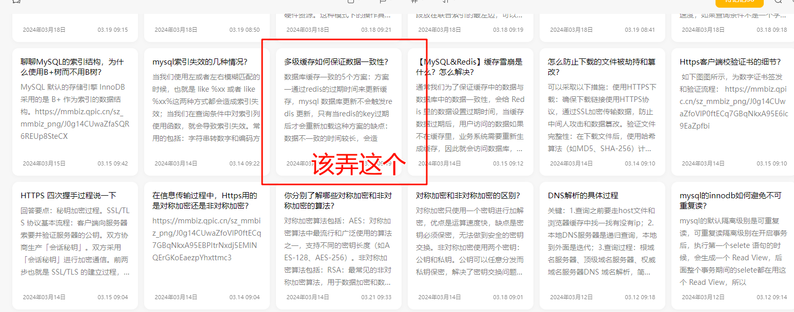

---
# This is the title of the article
title: markdown拓展用法测试
# This is the icon of the page
icon: file
# This control sidebar order
# order: 1
# Set author
# author: Ms.Hope
# Set writing time
date: 2024-05-03
# A page can have multiple categories
# category:
#   - 八股
# A page can have multiple tags
tag:
  - 其他
# this page is sticky in article list
# sticky: true
# this page will appear in starred articles
# star: true
# You can customize footer content
# footer: Footer content for test
# You can customize copyright content
# copyright: No Copyright
---
参考：
https://ecosystem.vuejs.press/zh/themes/default/markdown.html#%E8%87%AA%E5%AE%9A%E4%B9%89%E5%AE%B9%E5%99%A8

::: tip
这是一个提示
:::

::: warning
这是一个警告
:::

::: danger
这是一个危险警告
:::

::: details
这是一个 details 标签11
:::

进度记录：
2024-5-4
