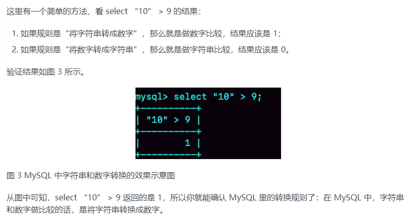

---
# This is the title of the article
title: 数据库-MySQL
# This is the icon of the page
icon: file
# This control sidebar order
# order: 1
# Set author
# author: Ms.Hope
# Set writing time
date: 2024-05-04
# A page can have multiple categories
category:
  - 八股
# A page can have multiple tags
tag:
  - 数据库
  - MySQL
# this page is sticky in article list
# sticky: true
# this page will appear in starred articles
# star: true
# You can customize footer content
# footer: Footer content for test
# You can customize copyright content
# copyright: No Copyright
---
::: tip 友情提示

- **内容建设：** 内容正在不断的完善中，如果对内容有疑问或者希望添加内容，请留言，欢迎提出建议。
- **转载说明：** 本站文章在创作过程中，部分内容整合了许多大佬的观点，在这里表示感谢，详见[版权说明][本站版权说明]，如有侵权或者不希望转载，请联系我添加出处或者删除相关内容。同时，如需转载本站文章，转载请在文首注明出处。

:::

## 建立联合索引时字段的顺序需要注意什么

**回答要点：**

- 最左匹配原则
- 区分度高的字段放在前面

**具体：**

**最左匹配原则：** 联合索引遵循最左匹配原则，即在查询时，只有按照索引字段的顺序从最左边开始连续使用索引字段，索引才会被使用。因此，根据最常用作查询条件的字段放在联合索引的最左边，可以提高索引的利用率。

**区分度高的字段放在前面：** 将区分度高的字段放在联合索引的前面，可以减少索引的扫描范围，提高查询效率。

::: tip 拓展
1. 常见的误区：最左匹配原则匹配的是索引字段的顺序，而与SQL语句中使用联合索引的顺序无关。举个例子：如果联合索引是a、b、c字段，那么如果SQL语句是`select * from table where a=1 and b=2 and c=3`和`select * from table where c=3 and b=2 and a=1`是一样的。
:::

## 怎么确定语句是否走了索引

**回答要点：**

- explain命令查看执行计划，关注key（实际使用到的索引）字段。

**具体：**

可以通过 explian查看执行计划来确认。

对于执行计划，参数有：

`possible_keys` 字段表示可能用到的索引；

`key` 字段表示实际用的索引，如果这一项为 NULL，说明没有使用索引；

`key_len` 表示索引的长度；

`rows` 表示扫描的数据行数。

`type` 表示数据扫描类型，我们需要重点看这个。

如果 `typy=all`，代表没有走索引，进行了全表扫描。如果 key 不为 null，说明用到了索引。

::: tip 拓展
相关问题：
1. 有一个命令特别慢，如何排查？ 一般从：explian查看执行计划分析；慢日志查询分析 两个角度出发
:::

## 一般是建立哪些字段的索引呢

**回答要点：**

- `WHERE` 查询条件的字段
- 用于 `GROUP BY` 和 `ORDER BY` 的字段
- 区分度大的字段

**具体：**

索引最大的好处是提高查询速度，我经常针对下面场景来建立索引：

字段有唯一性限制的，比如商品编码；

经常用于 `WHERE` 查询条件的字段，这样能够提高整个表的查询速度，如果查询条件不是一个字段，可以建立联合索引。

经常用于 `GROUP BY` 和 `ORDER BY` 的字段，这样在查询的时候就不需要再去做一次排序了，因为我们都已经知道了建立索引之后在 B+Tree 中的记录都是排序好的。

::: tip 拓展

相关问题：
1. 有一个命令特别慢，如何排查？ 一般从：explian查看执行计划分析；慢日志查询分析 两个角度出发
2. 如果字段区分度过小，那么MySQL可能会认为这个字段没有索引，直接走全表扫描。 解决方案：思路都是增加区分度，具体做法类似于身份证建立索引的方法：1.使用hash建立索引；2.先倒序再建立索引
:::

## MySQL的索引结构，为什么使用B+树而不用B树

**回答要点：**

- B+ 树的非叶子节点不存放实际的记录数据，仅存放索引，因此B+ 树可以比B树更矮胖，磁盘I/O次数会更少
- B+ 树有大量的冗余节点（所有非叶子节点都是冗余索引），冗余索引使B+树减少了树形的变化，更加高效
- B+ 树叶子节点之间用链表连接了起来，有利于范围查询

**具体：**
MySQL 默认的存储引擎 InnoDB 采用的是 B+ 作为索引的数据结构。

B+ 树的非叶子节点不存放实际的记录数据，仅存放索引，因此数据量相同的情况下，相比存储即存索引又存记录的 B 树，B+树的非叶子节点可以存放更多的索引，因此 B+ 树可以比 B 树更「矮胖」，查询底层节点的磁盘 I/O次数会更少。

B+ 树有大量的冗余节点（所有非叶子节点都是冗余索引），这些冗余索引让 B+ 树在插入、删除的效率都更高，比如删除根节点的时候，不会像 B 树那样会发生复杂的树的变化；

B+ 树叶子节点之间用链表连接了起来，有利于范围查询，而 B 树要实现范围查询，因此只能通过树的遍历来完成范围查询，这会涉及多个节点的磁盘 I/O 操作，范围查询效率不如 B+ 树。

::: tip 拓展

虽然B+树一般磁盘IO会更少，但是由于B树非叶子节点也会存放数据，如果查询的数据正好在B树的非叶子节点，那么此时B树会更快一些。
:::

## MySQL索引失效的几种情况

**回答要点：**

- 左或者左右模糊匹配
- 索引列使用函数
- 索引包含表达式计算
- 隐式类型转换
- 联合索引不符合最左匹配原则

**具体：**

使用左或者左右模糊匹配的时候，也就是 `like %xx` 或者 `like %xx%`这两种方式都会造成索引失效；

当我们在查询条件中对索引列使用函数，就会导致索引失效，比如：`month(t_modified)=7`。常用的还包括：字符串转数字和编码方式的转换

当我们在查询条件中对索引列进行表达式计算，也是无法走索引的。

MySQL 在遇到字符串和数字比较的时候，会自动把**字符串转为数字**，然后再进行比较。如果字符串是索引列，而条件语句中的输入参数是数字的话，那么索引列会发生隐式类型转换，由于隐式类型转换是通过 CAST 函数实现的，等同于对索引列使用了函数，所以就会导致索引失效。

联合索引要能正确使用需要遵循最左匹配原则，也就是按照最左优先的方式进行索引的匹配，否则就会导致索引失效。

::: tip 拓展

- [隐式类型转换]：MySQL究竟是字符串转数字还是数字转字符串：
- [隐式类型转换]：一种很不常见的隐式类型转换：多表联查的时候如果字符集编码不同，那么可能导致字符集编码转换
- 常见误区：最左匹配原则与SQL语句中where后面字段的具体顺序无关，可见[如果要建立联合索引，字段的顺序有什么需要注意吗](#建立联合索引时字段的顺序需要注意什么)
- 如果字段区分度太小，那么InnoDB默认会走全表。
- 可以联系[一般是建立哪些字段的索引呢](#一般是建立哪些字段的索引呢)这一问题
- 在对索引使用函数之后，MySQL的优化器并不是会放弃索引，只是优化器就决定放弃走树搜索功能！！，会扫描全表，但是 扫描全表 != 不使用索引。比如上面`month(t_modified)=7`，优化器经过判断后，仍然会判断使用 `t_modified索引` 优于 主键索引 ，因此**会走`t_modified`索引**。
:::

[本站版权说明]: /more_about/context.md